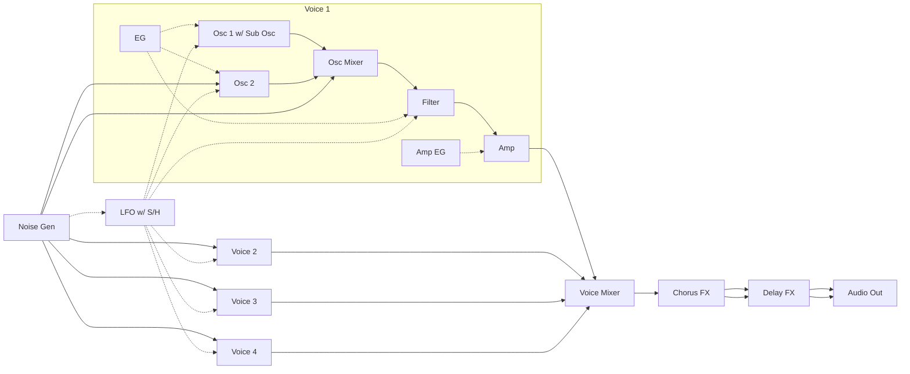
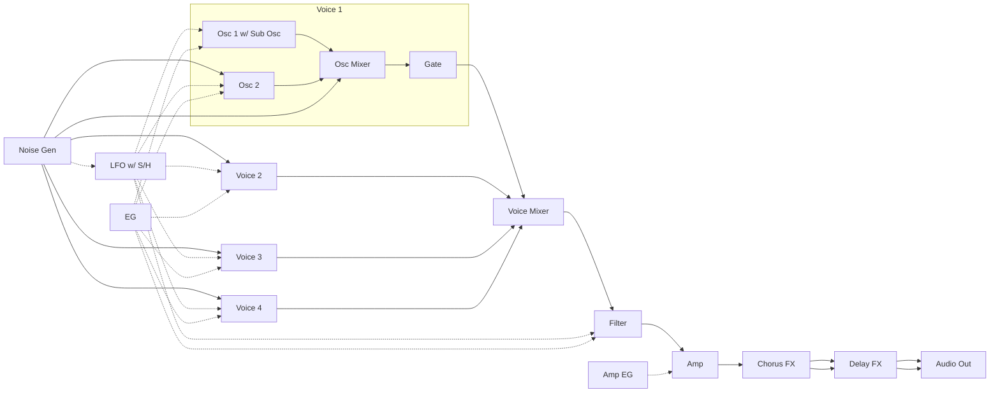
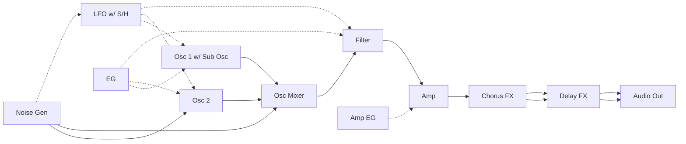
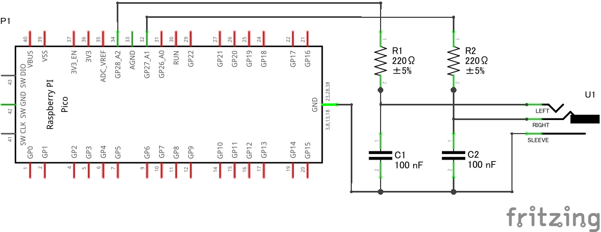
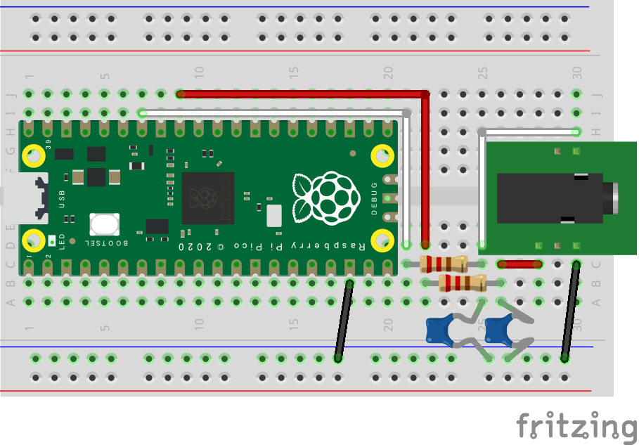

# pico SDK version of PRA32-U v3.3.2

[original project](https://github.com/risgk/digital-synth-pra32-u)


## Overview

- 4 Voice Polyphonic/Paraphonic Synthesizer for Raspberry Pi Pico/RP2040
  - Built-in Chorus and Delay FX
  - Controlled by MIDI -- PRA32-U is a MIDI sound module
  - Having the function of writing the parameters to the user programs and the flash
  - Step sequencer (32 step)
- WS2812 RGB LEDs support
- An **I2S DAC** hardware (e.g. Pimoroni Pico Audio Pack) is required
  - PWM Audio can also be used instead of I2S (PWM Audio does not require an I2S DAC hardware)
    - KNOWN ISSUE: When using PWM Audio, signal discontinuity occurs approximately every 60-80 milliseconds
      - Click noise is particularly noticeable in the high frequency band and sine waves
- Prebuilt UF2 files for [original hw](https://github.com/risgk/digital-synth-pra32-u)/[nizkoteno](https://github.com/aroum/PNCATEHO)/[omsk](https://github.com/aroum/omsk) in [release section](https://github.com/aroum/pra32-u-pico-sdk/releases/)

## Preparation for modification

- Fork the repository
- Modify the code
- Run the GitHub Action

For local builds, you can use the `build_all.sh` file.

``` shell
./build_all.sh -h
Usage: ./build_all.sh [options]
Board detected: nizkoteno (via config.h)
Options:
  -b, --board    Specify board (pra32, nizkoteno, omsk)
  -c, --clean    Remove build directory and re-run CMake
  -s, --size     Show detailed memory usage report
  -f, --flash    Build and flash to RP2040 via picotool
  -h, --help     Show this help message

Example: ./build_all.sh -csf (Clean, Show Size, and Flash)
```

## Features

For detailed configuration, edit the `include/config.h` file.

### MIDI (Input)

#### USB MIDI Device (Default)

- MIDI Device Name: "PRA32-U" / "Nizkoteno" / "Omsk"

#### UART MIDI (Optional)

- UART MIDI can also be used
  - Noise caused by USB communication can be avoided
- Uncomment out `//#define PRA32_U_USE_UART_MIDI` in "Digital-Synth-PRA32-U.ino"
  and modify `PRA32_U_UART_MIDI_SPEED`, `PRA32_U_UART_MIDI_TX_PIN`, and `PRA32_U_UART_MIDI_RX_PIN`
  - Speed: 31250 bps (default, for DIN/TRS MIDI) or 38400 bps (for PC)

### Audio (Output)

#### I2S (Default)

- Use an I2S DAC (Texas Instruments PCM5100A, PCM5101A, or PCM5102A is recommended), Sampling Rate: 48 kHz, Bit Depth: 16 bit
- NOTE: Select CPU Speed: "153.6 MHz"

#### PWM Audio (Optional)

- PWM Audio can also be used instead of I2S
  - NOTE: Probably smaller output volume than I2S DAC boards
  - NOTE: To avoid noise, the parameters will not be written to the flash when using PWM audio
  - We recommend adding RC filter (post LPF) circuits to reduce PWM ripples
    - A 1st-order LPFs with a cutoff frequency 7.2 kHz (R = 220 ohm, C = 100 nF) works well
  - See "PWM audio" in [Hardware design with RP2040](https://datasheets.raspberrypi.com/rp2040/hardware-design-with-rp2040.pdf)
      for details on PWM audio
- NOTE: Select CPU Speed: "150 MHz"

## Files

- "utilities/pra32-u-make-sample-wav-file.cc" is for debugging on PC
  - GCC (g++) for PC is required
  - "utilities/pra32-u-make-sample-wav-file-cc.bat" makes a sample WAV file (working on Windows)
- "generators/pra32-u-generate-*.rb" generates source or header files
  - A Ruby execution environment is required

## PRA32-U Editor

- "pra32-u-editor.html": Editor (MIDI Controller) Application for PRA32-U, HTML App (Web App)
  - Modify `MIDI_CHANNEL` to change the MIDI Channel
- We recommend using Google Chrome, which implements Web MIDI API
- Select "Digital Synth PRA32-U" in the list "MIDI Out"
- Functions
  - PRA32-U Editor converts Program Changes (#0-7 for Preset programs, #8-15 for user programs) into Control Changes
  - When Program Change #127 is entered or Control Change #111 is changed from Off (63 or lower) to On (64 or higher), "Rand Ctrl" is processed
  - PRA32-U Editor stores the current control values and the user programs (#8-15) in a Web browser (localStorage)
  - Current parameter values and user programs (#8-15) can be imported/exported from/to JSON files
- When not using PRA32-U Editor
  - PRA32-U can also be controlled by MIDI without using PRA32-U Editor
  - Refer to "PRA32-U-MIDI-Implementation-Chart.txt" for the supported functions
  - The default program is #8
  - Programs #0-15 can be modified by editing "pra32-u-program-table.h"
  - PRA32-U Editor functions related to parameter writing
    - Write: Write the current parameters to PRA32-U (Program #8-15 and the flash)
    - Program Change: Send Program Change to PRA32-U directry
          (NOTE: The current parameters of PRA32-U will not be updated)

## [Parameter Guide](docs/PRA32-U-Parameter-Guide.md)

## [MIDI Implementation Chart](docs/PRA32-U-MIDI-Implementation-Chart.md)

## [Nizkoteno layout](docs/nizkoteno_pra32_layout.md)

## Synthesizer Block Diagram

### Polyphonic Mode



### Paraphonic Mode



### Monophonic Mode



## Simple Circuit for PWM Audio

### Circuit Diagram (Simple Circuit for PWM Audio)



- This image was created with Fritzing.
- Adding 10 uF electrolytic capacitors (AC coupling capacitors) will cut the DC components of the audio outputs.
- NOTE: Connect an amplifier or an active speaker to the audio jack.
  Connecting a headphone or a passive speaker may cause a large current to flow and damage the devices.

### Actual Wiring Diagram (Simple Circuit for PWM Audio)



- This image was created with Fritzing.

## Original License


**Digital Synth PRA32-U v3.3.2 by ISGK Instruments (Ryo Ishigaki)**

To the extent possible under law, ISGK Instruments (Ryo Ishigaki)
has waived all copyright and related or neighboring rights
to Digital Synth PRA32-U v3.3.2.

You should have received a copy of the CC0 legalcode along with this
work.  If not, see <http://creativecommons.org/publicdomain/zero/1.0/>.

### For Your Information

- Powered by ISGK Instruments PRA32-U
- Modified by aroum
